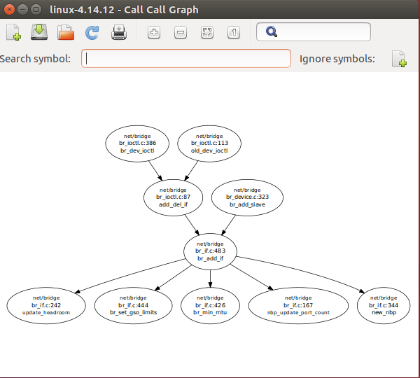

# Call Call Graph

A caller/callee graph visualzer based on [cscope][1], [graphviz][2], [xdot][3].
Previous work is from [chihchun][4]

# Screenshots

* Linux 4.14.12 add_del_if()

  

[1]: http://cscope.sourceforge.net/
[2]: http://www.graphviz.org/
[3]: http://code.google.com/p/jrfonseca/wiki/XDot
[4]: https://github.com/chihchun/callgraphviz

